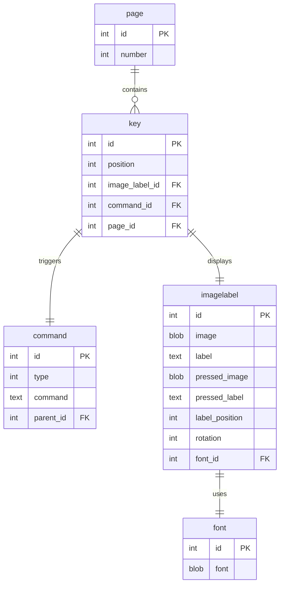

# Database diagram

```mermaid
erDiagram
    PAGE[page] {
        int id PK
        int number
    }
    COMMAND[command] {
        int id PK
        int type
        text command
        int parent_id FK
    }
    IMAGE-LABEL[imagelabel] {
        int id PK
        blob image
        text label
        blob pressed_image
        text pressed_label
        int label_position
        int rotation
        int font_id FK
    }
    FONT[font] {
        int id PK
        blob font
    }
    KEY[key] {
        int id PK
        int position
        int image_label_id FK
        int command_id FK
        int page_id FK
    }
    PAGE ||--o{ KEY : contains
    KEY ||--|| COMMAND : triggers
    KEY ||--|| IMAGE-LABEL : displays
    IMAGE-LABEL ||--|| FONT : uses
```
